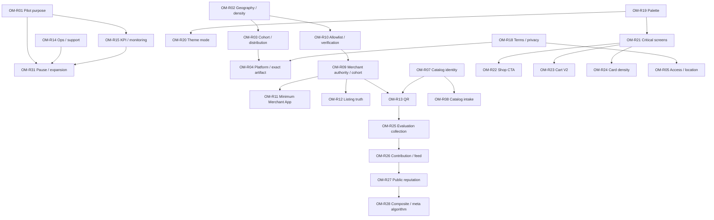

# Owner Master Dependency Graph

State: `24 ROOTS FINAL — 0 OPEN / 3 PROVISIONAL / 4 DEFERRED`

## Applied decision state

- `OM-R04=A` unlocks Android-only release preparation and UI-R15 evidence work;
  exact artifact/physical acceptance remains open.
- `OM-R05=A` resolves guest discovery and contextual AuthGuard; KVKK remains open.
- `OM-R19=A` and `OM-R20=A` resolve palette and pilot mode prerequisites.
- `OM-R21=A` unlocks bounded critical-screen C1 work and its six dependent UI
  implementation details.
- `OM-R22=A`, `OM-R23=A`, `OM-R24=A` close the Shop CTA, Cart meaning and card
  density owner decisions.
- `OM-R01=A`, `OM-R02=A` and `OM-R03=A` resolve the pilot objective, bounded
  density-ready cells and controlled staged cohort; exact cells/thresholds stay open.
- `OM-R09=A`, `OM-R10=A` and `OM-R11=B` resolve the merchant cohort to ordinary
  single-owner shops using a minimum safe Merchant App; regulated capability
  remains fail-closed and the full app is not approved.
- `OM-R12=A` and `OM-R13=A` unlock listing-truth and gated exact-shop QR contract
  planning without approving an enum/schema or passing physical acceptance.
- `OM-R14=A` through `OM-R18=A` resolve lean operations, minimum evidence,
  bounded no-charge offer, community-led acquisition and professionally reviewed
  launch surfaces. Their listed lawyer/KVKK/accounting/regulatory gates remain open.
- `OM-R31=A` resolves stop/continue/expand governance without selecting numeric
  thresholds.
- `OM-R06=B` resolves taxonomy activation planning to a stable-ID staged,
  rollback-aware strategy; it does not authorize migration, activation, ID
  generation or demo retirement.
- `OM-R07=B` resolves Product/domain-gated Variant/Listing identity and preserves
  Listing ownership of price, availability/stock and merchant SKU. `OM-R08`
  publication governance remains provisional.

The graph topology is unchanged. The 24 final roots auto-resolve only their mapped
child/dependent records. A final parent answer does not auto-pass runtime,
physical or professional gates.

## High-leverage graph

## Complete dependency registry

| Root | BLOCKS / UNLOCKS | AUTO-RESOLVES | CAN WAIT | PROFESSIONAL INPUT |
|---|---|---|---|---|
| OM-R01 | R15, R31 | KPI purpose hierarchy | NO | NONE |
| OM-R02 | R03, R10, R14, R31 | launch-cell eligibility vocabulary | NO | NONE |
| OM-R03 | R04, R14 | track/cohort mechanics | NO | NONE |
| OM-R04 | R21 final acceptance, R31 | UI-R15 evidence detail; CI vendor is engineering | NO | NONE |
| OM-R05 | R17, UI implementation | UI-R06 AuthGuard copy after access rule | NO | KVKK |
| OM-R06 | R08 if new taxonomy is activated | migration batching details | YES if current runtime retained | NONE |
| OM-R07 | R08, R12, R13, R26 | merge/split lineage invariant | NO for catalog implementation | NONE |
| OM-R08 | R12 | candidate queue mechanics | CONDITIONAL | REGULATORY |
| OM-R09 | R11, R12, R13 | staff/branch triggers after cohort evidence | NO | NONE |
| OM-R10 | R09, R11, R12 | regulated scope remains closed by default | NO | LAWYER, REGULATORY |
| OM-R11 | merchant implementation | packaging after operating model | NO | NONE |
| OM-R12 | R31 | exact reminder cadence after baseline | NO | LAWYER for claims |
| OM-R13 | R25, R26, R31 | history depth after rollout scope | NO if QR pilot enabled | NONE |
| OM-R14 | R31 | tool choice and queue transport | NO | LAWYER for user-facing process |
| OM-R15 | R31 | dashboard layout after KPI set | NO | KVKK |
| OM-R16 | R09, R17 | offer copy after commercial shape | NO | ACCOUNTANT before billing/tax claims |
| OM-R17 | R15 | channel instrumentation | CONDITIONAL | KVKK for research/paid channels |
| OM-R18 | R04, R05, R14 | final wording after professional review | NO | LAWYER, KVKK |
| OM-R19 | R20–R24 | fallback/status token roles | NO for UI rollout | NONE |
| OM-R20 | R21 | dark-mode implementation scope | NO for UI rollout | NONE |
| OM-R21 | R22–R24 | motion/icon defaults | NO for UI rollout | NONE |
| OM-R22 | Shop Details implementation | component placement | NO for UI rollout | NONE |
| OM-R23 | R13 education surface | layout mechanics | NO for UI rollout | NONE |
| OM-R24 | list/card implementation | breakpoints after density | NO for UI rollout | NONE |
| OM-R25 | R26 | exact wording after question set | YES if structured data not in pilot | KVKK before collection |
| OM-R26 | R27 | projection queries after identity rule | YES if structured data not in pilot | KVKK |
| OM-R27 | R28 | public surfaces after timing choice | YES | LAWYER, KVKK |
| OM-R28 | none | threshold/formula calibration | YES | LAWYER, KVKK, TECHNICAL ARCHITECT |
| OM-R29 | Ads children | pricing/attribution only if enabled | YES | LAWYER, KVKK |
| OM-R30 | Reward children | earning/redemption only if enabled | YES | LAWYER, ACCOUNTANT |
| OM-R31 | launch/expansion authority | second-district checklist after first-cell evidence | NO | NONE |

## Review-order rules

1. Purpose/geography/cohort precede platform and staffing.
2. Merchant authority/policy precede Merchant App, listing and QR implementation.
3. Catalog identity precedes catalog intake and QR product evidence.
4. QR evidence precedes structured evaluation identity.
5. Collection precedes public reputation; public primary reputation precedes
   composite/meta algorithms.
6. Palette/mode precede critical-screen and component acceptance.
7. Ads and Reward stay off the pilot critical path unless the parent timing answer
   explicitly brings them forward.

## Graph assurance

- Roots without inbound dependency are valid session entry points, not orphans.
- Every source decision maps to exactly one root.
- Directed cycles: `0`
- Duplicate roots: `0`
- Final roots: `8/31`
- Open roots: `23/31`

`MASTER_DEPENDENCY_GRAPH: PASS`
