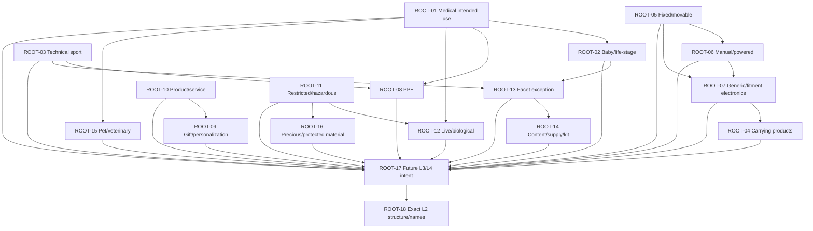

# Taxonomy Owner Decision Optimal Order

## Status

**RECOMMENDED REVIEW ORDER — NOT OWNER APPROVED / NOT CANONICAL**

The order below minimizes backtracking. It respects every dependency recorded in the minimum-root set and postpones the 22-domain structure/name ballot until the reusable boundary rules exist.

## Dependency contract

Direct prerequisites used here:

| Root | Direct prerequisites |
|---|---|
| ROOT-01 | — |
| ROOT-02 | ROOT-01 |
| ROOT-03 | — |
| ROOT-04 | ROOT-07 |
| ROOT-05 | — |
| ROOT-06 | ROOT-05 |
| ROOT-07 | ROOT-05, ROOT-06 |
| ROOT-08 | ROOT-01, ROOT-03 |
| ROOT-09 | ROOT-10 |
| ROOT-10 | — |
| ROOT-11 | — |
| ROOT-12 | ROOT-01, ROOT-11 |
| ROOT-13 | ROOT-02, ROOT-03 |
| ROOT-14 | ROOT-13 |
| ROOT-15 | ROOT-01 |
| ROOT-16 | ROOT-11 |
| ROOT-17 | ROOT-01–ROOT-16 |
| ROOT-18 | ROOT-01–ROOT-17 |

The broad dependencies on ROOT-17 and ROOT-18 are convergence gates: they should consume prior answers, not reopen them.

## Dependency graph

## Optimal sequence

| Order | Root | Why now | What it unlocks | Raw decision prompts made obsolete | Expected owner effort |
|---:|---|---|---|---:|---|
| 1 | ROOT-01 — Medical intended use | Highest cross-domain policy boundary and prerequisite for baby, PPE, live/biological and veterinary discussions. | ROOT-02, ROOT-08, ROOT-12, ROOT-15; common intended-use vocabulary. | 0 distinct sub-questions; 6 remain deliberately visible. | 6–10 min product posture; specialist legal/compliance work later. |
| 2 | ROOT-11 — Weapon-like/hazardous recreation | Establishes fail-closed V1 posture before reviewing live/biological and protected-material risk. | ROOT-12, ROOT-16; restricted-family exclusion pattern. | 0 distinct sub-questions; 3 regulated-family questions remain. | 5–8 min for V1 posture; item allowlists deferred. |
| 3 | ROOT-10 — Product versus service | A broad non-policy boundary that prevents installation, preparation, subscription and personalization from contaminating product nodes. | ROOT-09 and service-leakage cleanup across domains. | 5 duplicate/raw prompts. | 3–5 min. |
| 4 | ROOT-05 — Fixed installation versus movable product | Creates the infrastructure boundary required before power and electronics fitment. | ROOT-06, ROOT-07; lighting, bathroom, HVAC and garden placement. | 4 duplicate/raw prompts. | 3–5 min; exact regulated allowlist later. |
| 5 | ROOT-06 — Manual versus powered household product | Converts the fixed/movable answer into a product-life-cycle rule for appliances. | ROOT-07; kitchen, cleaning and personal-care device boundaries. | 1 duplicate/raw prompt. | 2–3 min. |
| 6 | ROOT-07 — Generic versus fitment/device-specific electronics | Highest direct ambiguity leverage after prerequisites: 33 primary ambiguous cases and 8 collisions. | ROOT-04; vehicle/tool/device fitment and component boundaries. | 4 duplicate/raw prompts. | 4–6 min. |
| 7 | ROOT-04 — Generic versus domain-specific carrying product | Uses the fitment/integration threshold rather than inventing a competing bag rule. | Stable bag/case/carrier boundary across Baby, Music, Sports and device domains. | 8 duplicate/raw prompts. | 3–5 min. |
| 8 | ROOT-03 — Technical sport product ownership | Product-form precedence is needed before certified protection and facet exceptions. | ROOT-08, ROOT-13; apparel, footwear and sport equipment separation. | 2 duplicate/raw prompts. | 3–4 min. |
| 9 | ROOT-08 — PPE and certified protection | Consumes medical-intent and sport-form answers, avoiding contradictory helmet/glove/shoe/eyewear rules. | Certified protection precedence and later L3/L4 evidence schema. | 7 duplicate/raw prompts. | 4–6 min; evidence vocabulary later. |
| 10 | ROOT-02 — Baby/life-stage ownership | Medical posture is now fixed; owner can decide when genuine baby-specific function overrides form. | ROOT-13; formula, care, toy, shoe, clothing and carrier routing. | 5 duplicate/raw prompts. | 4–6 min; formula eligibility later. |
| 11 | ROOT-15 — Pet nutrition/veterinary health | Applies the already-decided medical intended-use model to animal-intended goods. | Pet food/supply versus regulated veterinary product boundary. | 0 distinct sub-questions; 3 species/regulated-product questions remain. | 5–8 min plus specialist eligibility follow-up. |
| 12 | ROOT-12 — Live and biological products | Both medical/biological and restricted/hazardous postures now exist. | Allowed-live-scope design and provenance/fulfilment requirements. | 0 distinct sub-questions; 3 live/biological questions remain. | 5–8 min; operational/legal review later. |
| 13 | ROOT-16 — Precious/high-value/protected materials | Can reuse the restricted-item and provenance posture from ROOT-11. | Jewelry/material evidence model and protected-material exclusions. | 0 distinct sub-questions; 2 provenance questions remain. | 4–7 min; commerce/compliance implementation later. |
| 14 | ROOT-09 — Gift purpose/personalization | Product/service has already prevented labor and fulfilment from becoming product identity. | Gift, keepsake, party and bundle no-duplication rule. | 6 duplicate/raw prompts. | 3–5 min. |
| 15 | ROOT-13 — Facet or controlled-category exception | Baby/life-stage and technical-sport exceptions are now concrete examples rather than abstract disagreements. | ROOT-14; traditional-instrument registry, toy-grade and collection decisions. | 7 duplicate/raw prompts. | 4–6 min. |
| 16 | ROOT-14 — Published content, supply and kit | Uses the facet/exception test to decide principal product without duplicating Books, Stationery and Toys. | Stable book/workbook/supply/kit boundary. | 7 duplicate/raw prompts. | 3–5 min; three edge products remain manual. |
| 17 | ROOT-17 — Same-L1 future L3/L4 intent | All cross-L1 precedence rules are known, so the remaining same-L1 rule can be consistent with them. | L3/L4 design for all non-final domains. | 2 duplicate/raw prompts. | 3–5 min. |
| 18 | ROOT-18 — Exact L2 structure and naming | It is the convergence ballot. Earlier decisions remove most repeated boundary debate and expose only true domain/editorial choices. | Bulk approvals, targeted edits and later canonical integration. | 0 distinct sub-questions; 47 source questions plus 40 naming findings remain explicit evidence. | Separate 30–60 min guided review; do not treat as one checkbox. |

## Review rounds implied by the sequence

1. **Global safety and scope:** ROOT-01, ROOT-11, ROOT-10.
2. **Physical/product mechanics:** ROOT-05, ROOT-06, ROOT-07, ROOT-04.
3. **Audience and protection:** ROOT-03, ROOT-08, ROOT-02.
4. **Policy-specialized applications:** ROOT-15, ROOT-12, ROOT-16.
5. **Projection and principal-product rules:** ROOT-09, ROOT-13, ROOT-14.
6. **Convergence:** ROOT-17, then ROOT-18.

## Obsolescence and effort reconciliation

- Safe-collapse roots eliminate **58** repeated raw prompts after their single root choice.
- Six non-collapsible roots preserve **64** distinct source follow-ups; no blanket choice is claimed to erase them.
- The sequence contains **18** root gates, of which ROOT-18 is a guided domain/editorial review protocol rather than a binary approval.
- Downstream root gates with prerequisites: **13**.
- Dependency violations in the proposed order: **0**.
- Policy/legal implementation work is outside the product-owner time estimates.

## Rules for using this order

- If the owner rejects a recommended option, update downstream simulations before reviewing dependent roots.
- Do not ask ROOT-18 domain/name questions before ROOT-01–ROOT-17 are recorded.
- A policy posture choice does not authorize restricted inventory or create a legal allowlist.
- Unchecked decisions remain proposed; silence is not approval.

`ROOT_DECISION_OPTIMAL_ORDER: PASS`

`DEPENDENCY_VIOLATIONS: 0`

`REPEATED_RAW_PROMPTS_AVOIDED: 58`

`OWNER_FINALIZATION: NOT_PERFORMED`
