# W45A-R2 — Tier A batch closeout

Başlangıç: 2026-09-05 03:41:34 Europe/Istanbul (araçla gözlenen başlangıç).
Branch: `astra-ui/w45a-tier-a-prototype-batch-1`; başlangıç HEAD `a261004`.
Worktree: `C:/Users/Mustafa/.codex/worktrees/6e1f/TStore_CLEAN`.
Eşit ağırlıklı kapsam: FS-19 Shop Details, FS-20 Cart V2, FS-18 Nearby.

Product Owner üç kompozisyonu onayladı. Cart CTA için nihai karar
`QR kod oluştur`; önceki prototip raporunun copy/onay-bekliyor kayıtları
tarihseldir. Yeniden tasarım veya Figma çalışması yoktur. Mevcut default-off
`visualPrototype` girişleri korunur; adayların runtime rollout'u integration
kararıdır. Shared primitives, caller'lar, backend, taxonomy ve QR kuralları
bu closeout'un dışında kalır.

## 1. Shop Details checkpoint

- Onaylı 390 px görüntü değişmedi. Tek FilledButton `Yol tarifi al`;
  ürün bölümü ve ikincil outlined iletişim düzeni korundu.
- Başlık için ayrı semantik sınır, ürün kartı için tam ad/button semantiği
  eklendi. Ürün loading/empty/error kartlarına kararlı test anahtarları eklendi.
- 320/390/430 × 100/130%: altı loaded golden ve altı uzun içerik testi.
  Uzun ad/adres/açıklama, haftalık saat metni (`Pazar: Kapalı`), 24 ürün,
  uzun ürün adı/büyük fiyat, mevcut olmayan ürün, puansız/eksik adres-saat,
  loading → loaded, repository error ve exception doğrulandı.
- `isActive` açık/kapalı saat bilgisine çevrilmedi. Mağaza entity'si route
  girdisidir; async loading/error yalnız ürün listesinde mevcut.
- Mevcut directions/telefon hedefleri, hata bildirimi, ürün ve chat handoff,
  geri navigation, erişilebilir etiketler ve Android touch-target testi geçti.
  Auth/pending chat ve duplicate navigation mevcut profile regresyonuyla geçti.
- Hedefli başlangıç: 19 PASS. Son: **40 PASS, 0 FAIL, 0 SKIP**:
  `flutter test --no-pub test/widget/shop/w45a_shop_profile_prototype_test.dart test/widget/shop/shop_profile_view_test.dart --reporter expanded`.
- İlk ek test çalışmasındaki iki sorun: başlık/geri semantiği birleşmesi
  düzeltildi; uzun listede test kaydırması hit-test edilebilir hedefe bağlandı.
  Test SemanticsHandle ömrü test bitiminden önce kapatıldı. Assertion kaldırılmadı.
- 13 yeni PNG; temsilî loaded, dar/büyük yazı, uzun içerik, ürün stresi ve
  error görüntüleri açılarak incelendi. Eski onaylı golden aynı kaldı.
- Shared değişiklik: NONE. Final analyzer/full-suite gate: sonraki paketler
  tamamlandıktan sonra birleşik olarak çalıştırılacak.

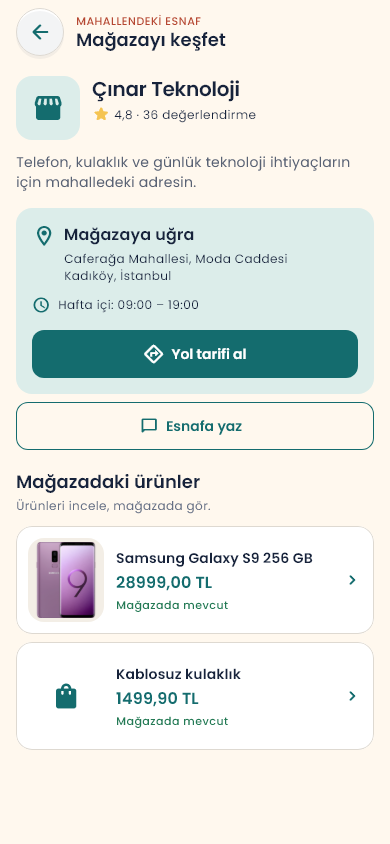
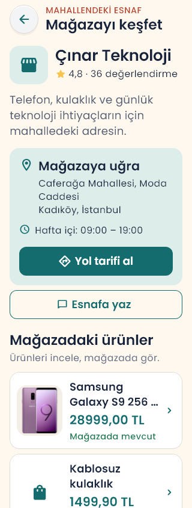
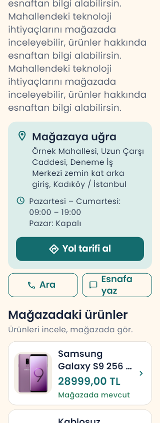

## 2. Cart V2 checkpoint

- **249 PASS, 0 FAIL, 0 SKIP**: `test/widget/cart`, `test/unit/cart`,
  W43 seller prototype + final goldens, W42 Product Details final goldens,
  `product_sellers_section_test.dart`, `settings_cart_navigation_test.dart`.
- 320/390/430 × 100/130% loaded ve uzun ürün/mağaza/adres + 99.999 adet /
  büyük fiyat testleri. Tutar ve adet gerektiğinde alt satıra geçer; sayı
  sıkıştırılmaz/kesilmez. Quantity sabit 24 px yerine minimum 24 px genişler.
- Initial/loading/error/empty 320/390/430 ve 130%; tek ürün, 24 ürün, son
  ürünün kaldırılması, unavailable/recovery, mutation error sırasında loaded
  içeriğin korunması, clear confirm/cancel/double-submit ve QR double-submit
  testleri eklendi. Existing price-change confirmation, QR validation/security,
  review/Purchases handoff ve cart business testleri değiştirilmeden geçti.
- `QR kod oluştur` exact assertion'ları korunur. Aynı
  `_preparePurchaseVerification` → refresh → mevcut QR sheet çağrılır.
  QR behavior/security/business-rule değişikliği **NO**.
- Quantity düğmelerinde compact density gerçek hedefi 40 px yapıyordu;
  standard density ve 48 px kapsayıcıyla 44 px minimum testi geçti.
  Kapsayıcının border/padding etkisi testle doğrulandı. Dar legacy Cart'ta
  bulunan 3 px taşma aynı private quantity widget'ında esnek satırla giderildi.
- Unavailable recovery düğmeleri authoritative theme fontunu artık korur;
  font yüklenmiş golden'da fallback blok yazı görünümü giderildi.
- 19 yeni Cart PNG ve bir güncellenen 390 prototype golden. 390 farkı C1
  dokunma hedefi/quantity satırı kaynaklıdır; kompozisyon değişmedi. Loaded,
  320/130 QR, büyük tutar, empty ve unavailable PNG'leri açılıp incelendi.
- Single-shop conflict Cart ekranında üretilmez; mevcut ekleme girişindeki
  `ProductSellersSection` dialog'udur. W43 testine 320/390/430, 130%, cancel ve
  exact listing/quantity ile confirm olmak üzere altı kontrol eklendi.
  `Sepete ekle` terminolojisi aynı kaldı.
- Yeni conflict testinin bulduğu mevcut Seller Comparison mesafe taşması:
  `lib/features/shop/presentation/widgets/seller_comparison_offer_card.dart`
  `_OfferFact` metni dar alanda Flexible ile sarılır. Daha geniş görünüm
  değişmedi; W43 ve W42 eski golden'ları yeniden üretilmeden geçti.

```text
SHARED_COMPONENT_CHANGE_REQUIRED: YES
EXACT_FILES: lib/features/shop/presentation/widgets/seller_comparison_offer_card.dart
REASON: 320 px / 130% mevcut gerçek mesafe metni 29–31 px taşıyordu.
CONSUMERS_AND_TESTS: ProductSellersSection visualPrototype → SellerComparisonView;
  W43 prototype/final golden, product_sellers_section, W42 final Product Details.
OWNER_BRANCH: astra-ui/w45a-tier-a-prototype-batch-1
COLLISIONS: NONE (eşzamanlı W45B dalının bu dosyada değişikliği yok)
```

`lib/core/ui`, theme/token, global navigation ve diğer Final UI runtime
dosyaları değiştirilmedi. Cart içindeki private quantity/recovery widget'ları
iki Cart sunumunda ortak kullanılır; ikisi de regresyon kapsamındadır.

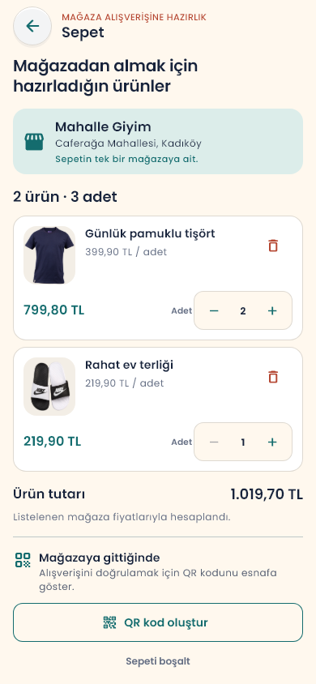
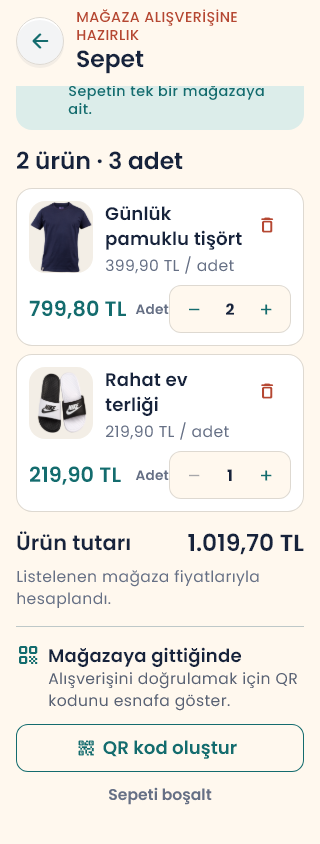
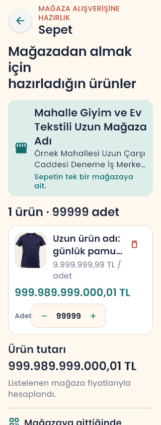
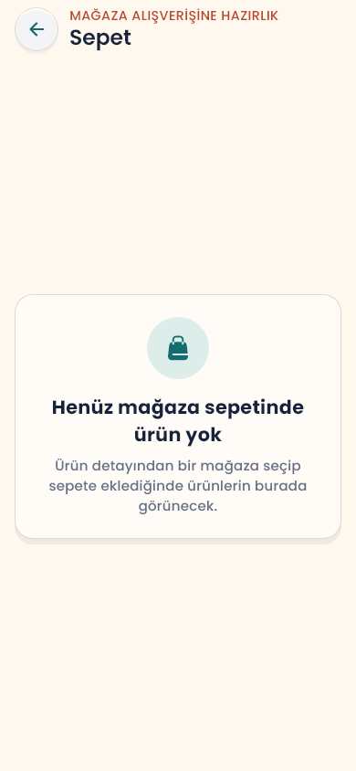

## 3. Nearby / Location checkpoint

- **164 PASS, 0 FAIL, 0 SKIP**: W45 Nearby, mevcut Nearby view/Cubit,
  geolocator service, Home location bar/nearby merchants/saved navigation,
  Saved Locations widget/Cubit.
- Loaded 320/390/430 × 100/130%; sekiz mevcut location status × üç genişlik,
  hepsi 130%; initial/loading/empty/error × üç genişlik, 130%.
- Kayıtlı ve cihaz konumu, permission denied/denied forever, service disabled,
  requesting/timed out/unavailable; consent cancel/confirm ve doğru settings
  hedefleri doğrulandı. State geçişinde mağazalar erişilebilir kaldı.
- Mesafe üst başlığı artık yalnız listelenen bir mağazada finite/non-negative
  mesafe varsa sıralama iddiası üretir. NaN/infinity/negatif, ilgisiz mağaza map
  girdileri ve stale non-ready mesafelerden proximity bilgisi üretilmez.
- Uzun mağaza/adres/açıklama/kayıtlı konum adı, puansız mağaza, büyük mesafe,
  30 mağaza, son karta kaydırma, double-tap navigation guard ve aynı listeye
  dönüş geçti. Default ShopProfileView hedefi ve original entity eşleşti.
- Default ShopProfileView gerçek bootstrap auth accessor'ını kullandığı için
  handoff testi mevcut `widget_test.dart` offline setup'ını kullanır: mock
  preferences, sentetik widget-test URL/public key, oturum/remote data yok.
  İlk testteki eksik bootstrap bu fixture içinde giderildi; runtime değiştirilmedi.
- Header ve kayıtlı konum satırı semantik sınırları eklendi. Mevcut location
  actions ve mağaza/selector düğmeleri etiket ve 44 px hedef testlerinden geçti.
- 22 yeni PNG; loaded, dar/130%, kalıcı izin reddi, bilinmeyen mesafe, uzun
  içerik, cihaz konumu ve empty kanıtları açılıp incelendi. Onaylı eski 390
  golden değişmedi. No new tracking, coordinates, remote merchants or data.
- Shared component değişikliği yok. Nearby tab kabuğu mevcut navigator/back
  modelini korur; ekstra geri eylemi veya konum davranışı eklenmedi.

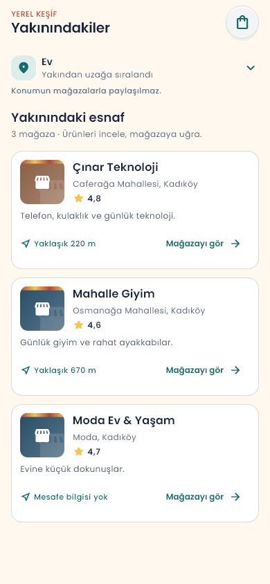
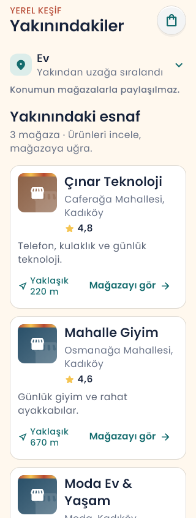
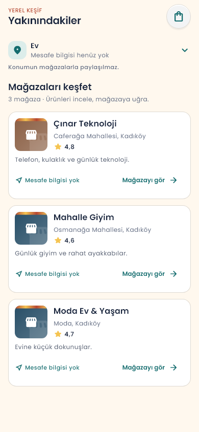
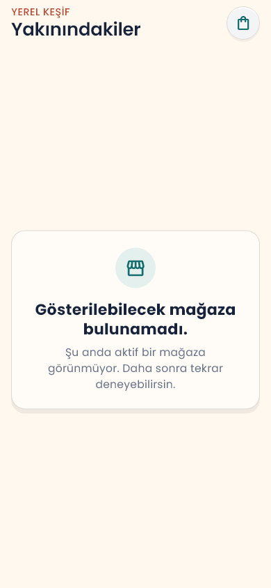

## Birleşik gate ve calibration

Bekliyor; bu checkpoint final batch PASS veya main entegrasyonu sayılmaz.
