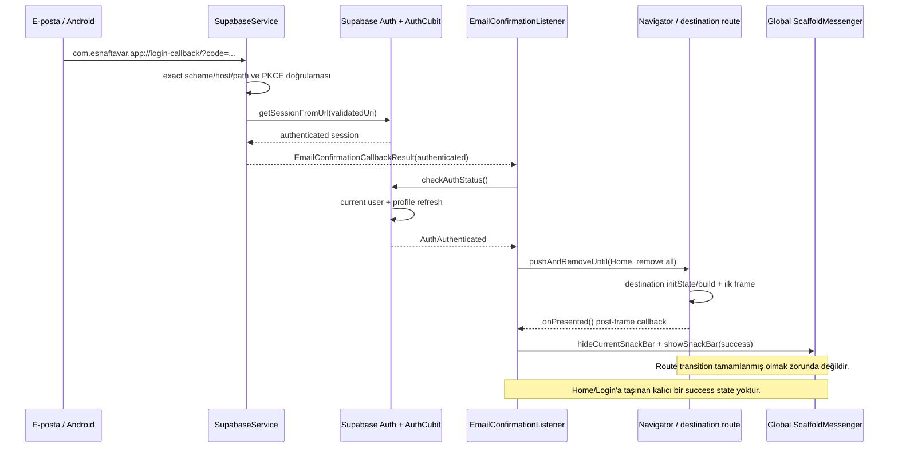
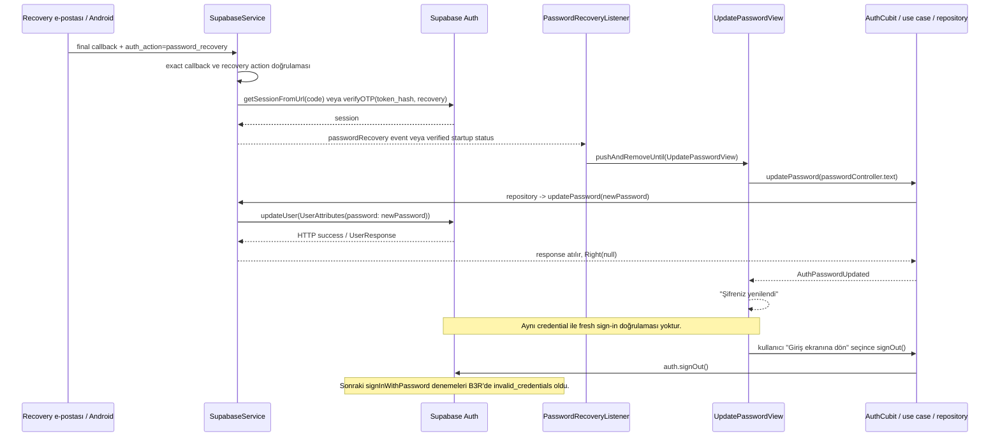

# Wave 11 Phase B4 — Auth confirmation ve recovery kök neden analizi

Tarih: 2026-08-22

Base: `origin/main@cd3e14138137c0d07a5050e094125b8a9fda0af8`

Branch: `agent2/w11-auth-root-cause-analysis`

## Kapsam ve güvenlik sınırı

Bu çalışma yalnız kod, test, mevcut kabul kaydı ve authenticated Supabase Dashboard
üzerinden salt okunur Production incelemesidir. Exact proje `EsnaftaVar Production`,
ref `mefhfvrgkwciubeajjeb` olarak doğrulandı. İnceleme anında Dashboard `Total: 0
users` gösterdi. Yeni kullanıcı, e-posta, recovery, resend, login, parola güncelleme,
silme veya başka bir fixture işlemi yapılmadı. Production ve Development üzerinde
hiçbir ayar/veri yazımı yapılmadı.

Bu analiz iki farklı sonucu özellikle ayırır:

- Confirmation başarı geri bildiriminin kaybolmasına yol açan istemci yaşam döngüsü
  sözleşmesi ve recovery ekranının erken/yanlış başarı üretme nedeni koddan
  belirlenmiştir.
- B3R kullanıcısının yeni parolasının neden daha sonra kullanılamadığına ilişkin
  sunucu tarafı nihai neden belirlenememiştir. İlgili Auth logları artık tutulmuyor
  ve kullanıcı güvenli biçimde silinmiştir.

## Yönetici özeti

| Konu | Sonuç | Güven |
| --- | --- | --- |
| Confirmation başarı olayı istemci tarafından dispatch edildi mi? | Evet, kod yolu ve widget testi düzeyinde | Yüksek |
| Mesaj destination tamamen görünür olduktan sonra mı dispatch ediliyor? | Hayır; yalnız destination ilk frame'i sonrasında, route transition tamamlanmadan | Yüksek |
| Home/Login başarı bilgisini kalıcı bir one-shot state olarak alıyor mu? | Hayır | Yüksek |
| Recovery update yöntemi | `client.auth.updateUser(UserAttributes(password: newPassword))` | Kesin |
| Update yanıtı doğrulanıyor mu? | Hayır; `UserResponse` atılıyor, exception yoksa başarı | Kesin |
| B3R parola değişimini kanıtlayan password-specific audit olayı | Bilinmiyor; retention nedeniyle erişilemez | Kesin sınır |
| Production'da görülen yanlış başarı neden oldu? | HTTP/no-exception sonucu doğrudan `AuthPasswordUpdated` yapıldı | Yüksek |
| Sunucunun hangi parolayı sakladığı / neden saklamadığı | Belirlenemedi | — |

## Canonical recovery başarı kriteri

Password recovery UI yalnız aşağıdaki beş koşul sırasıyla doğrulandığında final başarı
gösterebilir:

1. Geçerli ve beklenen kullanıcıya ait recovery session/provenance mevcuttur.
2. Password update request başarılıdır ve response beklenen kullanıcıyla tutarlıdır.
3. Recovery session kontrollü biçimde temizlenmiştir.
4. API'ye gönderilen aynı yeni password ile fresh normal login başarılıdır.
5. Fresh login edilen user identity beklenen kullanıcı identity'siyle eşleşir.

Yalnız HTTP `200`, generic `user_modified` veya exception oluşmaması final recovery
success değildir.

## 1. Confirmation başarı geri bildirimi

### Runtime zaman çizelgesi

### Kod kanıtı

- `SupabaseService` exact callback'i doğrulayıp
  `auth.getSessionFromUrl(validatedUri)` çağırır ve sonucu sequence numaralı
  `EmailConfirmationCallbackResult` olarak yayınlar
  (`lib/core/supabase/supabase_service.dart:93-139`).
- `EmailConfirmationListener` callback'i sequence ile dedupe eder, profile/auth
  durumunu `checkAuthStatus()` ile yeniler ve Home ya da Login route'unu
  `pushAndRemoveUntil` ile açar
  (`lib/features/auth/presentation/widgets/email_confirmation_listener.dart:64-108`).
- Başarı mesajı route push çağrısından dönen bir completion'a bağlı değildir.
  `_EmailConfirmationDestination.initState` içindeki tek bir post-frame callback,
  destination'ın ilk frame'inden sonra `onPresented` çağırır
  (`email_confirmation_listener.dart:127-151`). İlk frame, Material route'un giriş
  animasyonunun tamamlandığı veya fiziksel olarak kullanıcıya yerleştiği anlamına
  gelmez.
- Mesaj destination state'inde tutulmaz. Global `ScaffoldMessengerState` üzerinde
  varsayılan süreli bir `SnackBar` açılır (`email_confirmation_listener.dart:111-115`).
- Listener `MaterialApp` ve `Navigator` dışında, `TStore` içindeki kalıcı root
  katmanındadır (`lib/t_store.dart:66-107`). Route'lar temizlendiğinde listener'ın
  dispose olması beklenmez. Mesaj eski waiting-screen `BuildContext`'iyle değil global
  key ile açılır.
- Home (`NavigationMenu`) kendi `Scaffold`'ını oluşturur ancak confirmation sonucu
  alan bir argüman/state/one-shot event tüketicisi yoktur
  (`lib/core/common/widgets/navigation_menu.dart`). Login için de böyle bir kontrat
  yoktur.

### Soruların kesin yanıtları

1. **Neden görünmedi?** İstemci “destination sunuldu” koşulunu route transition
   tamamlanmasıyla değil destination'ın ilk frame'iyle eşitliyor. Başarı daha sonra
   Home/Login tarafından sahiplenilmeyen, tekrar üretilemeyen kısa bir Snackbar olarak
   dispatch ediliyor. Fiziksel app-switch + route transition sırasında gözden kaçan
   mesajı yeniden gösterecek kalıcı state yok.
2. **Olay emit edildi mi?** Evet, istemci dispatch yolu açısından. Fiziksel Home'un
   açılması destination builder'ın çalıştığını; post-frame wrapper ve mevcut widget
   testi de `_showMessage` yolunun çalıştığını gösteriyor. Cihaz üzerinde render
   telemetry'si olmadığı için “kaç frame boyandı” ayrıca kanıtlanamaz.
3. **Context dispose nedeniyle mi kayboldu?** Hayır. Root listener kalıcı ve mesaj
   global `ScaffoldMessengerKey` ile açılıyor. Sorun eski context'in dispose olması
   değil; dispatch'in route tamamen görünür olmadan yapılması ve feedback'in durable
   olmaması.
4. **Kim sahiplenmeli?** Nihai Home veya Login destination route'u, callback sonucunu
   yalnız bir kez tüketilen destination-owned bir state olarak sahiplenmeli. Event,
   gerçekten render edildikten sonra acknowledge edilmelidir.

### Confirmation hipotez sıralaması

| Hipotez | Derece | Kanıt |
| --- | --- | --- |
| İlk-frame callback + geçici Snackbar, fiziksel route görünürlüğü için yetersiz | **HIGH** | `initState` post-frame ile route completion eşitlenmiş; Home/Login'da kalıcı event yok; B3R'de Home PASS, mesaj FAIL |
| App switch, ilk Home yükleri veya frame gecikmesi kısa mesajı algılanamaz kıldı | MEDIUM | Fiziksel akışla uyumlu; cihaz render telemetry'si yok |
| Global messenger henüz bağlı değildi | LOW | Destination aynı `MaterialApp` içinde build oluyor ve widget testi mesajı buluyor |
| Listener route temizliğiyle dispose oldu | Ruled out | Listener `MaterialApp`/Navigator dışında |
| Duplicate callback koruması ilk geçerli UI olayını yuttu | Ruled out | Sequence set'i yalnız aynı sonucu ikinci kez engelliyor; ilk sonuç Home'u açtı |
| Auth refresh başarı state'ini temizledi | Ruled out | Başarı Auth state'te hiç tutulmuyor; sorun zaten bu kontratın olmaması |

### Minimal confirmation düzeltme planı

1. `EmailConfirmationListener` içinde callback navigation kararını koru, fakat başarıyı
   Snackbar çağrısı olarak hemen tüketme.
2. Tek kullanımlık confirmation success bilgisini destination route state'ine geçir;
   Home/Login ilk gerçekten görünür frame/route completion sonrasında destination-owned
   görünür bir banner/notice render etsin ve ancak render sonrası acknowledge etsin.
3. Duplicate callback aynı mesajı ikinci kez üretmemeli; cold start ve resumed app aynı
   event contract'ını kullanmalı.
4. Eski route `BuildContext`'ine veya yalnız navigator animation timing'ine bağlı çözüm
   eklenmemeli.
5. Regression testleri: cold-start initial callback, resumed callback, yavaş profile
   refresh, tamamlanmamış route transition, Home ve Login destination, duplicate
   callback ve feedback'in tam bir görünür frame boyunca destination'da kalması.

## 2. Recovery session ve parola güncelleme

### Runtime zaman çizelgesi

### Exact kod yolu ve session bulgusu

- Recovery redirect exact callback'e `auth_action=password_recovery` ekler. Callback
  contract bu action'ı ordinary confirmation'dan ayırır.
- PKCE yolunda `auth.getSessionFromUrl(validatedUri)` sonucu session içeriyorsa startup
  status `verified` olur; token-hash fallback yolu `verifyOTP(...,
  type: OtpType.recovery)` sonucunda session arar
  (`lib/core/supabase/supabase_service.dart:143-180`, `320-361`).
- `PasswordRecoveryListener`, `AuthChangeEvent.passwordRecovery` veya verified startup
  status ile update ekranını açar. B3R'nin bu ekrana ulaşması ve update endpoint'inin
  Auth session missing hatası yerine HTTP 200 dönmesi, update anında aynı Supabase
  client'ta authenticated session bulunduğuna güçlü kanıttır.
- Bununla birlikte uygulama “recovery session provenance” bilgisini update komutuna
  kadar taşımıyor. `PasswordRecoveryLaunchStatus.verified` yalnız ekranı açtırıyor;
  beklenen user id/session/recovery intent update öncesi ve sonrası doğrulanmıyor.
- Exact update çağrısı
  `client.auth.updateUser(UserAttributes(password: newPassword))`
  (`lib/core/supabase/supabase_service.dart:465-468`).
- `AuthRepositoryImpl.updatePassword` dönen `UserResponse` nesnesini tamamen atıyor ve
  exception yoksa `Right(null)` döndürüyor
  (`lib/features/auth/data/repositories/auth_repository_impl.dart:272-286`).
- `AuthCubit` herhangi bir `Right` sonucunu doğrudan `AuthPasswordUpdated` yapıyor
  (`lib/features/auth/presentation/cubit/auth_cubit.dart:161-171`). UI da yalnız bu state
  ile “Şifreniz yenilendi” metnini gösteriyor
  (`lib/features/auth/presentation/views/password_configuration/update_password_view.dart:68-72`,
  `220-252`).
- Sign-out update sonrasında otomatik değildir; kullanıcı başarı ekranındaki düğmeye
  bastığında çalışır. Bu nedenle update çağrısından önce client session'ının temizlenmesi
  veya eski session'ın update'i kesmesi yönünde kod kanıtı yoktur.
- Update parolayı `_passwordController.text` olarak trim/normalize etmeden gönderir.
  Login de parolayı opaque değer olarak trim etmeden aynı Supabase client'ın
  `signInWithPassword` metoduna verir. Confirm controller yalnız equality validation
  yapar; yeni parola controller'ını overwrite/clear eden kod yoktur. Controller'lar
  view dispose olana kadar yaşar.

### Production Auth audit incelemesi

2026-08-22'de authenticated Dashboard ile exact Production ref doğrulandı ve Auth
logs ekranında B3R penceresi istendi. Proje Free planındadır ve Dashboard açıkça yalnız
**1 günlük log retention** gösterdi. B3R olayı bu pencerenin dışındadır. Ayrıca Auth
Audit Logs ayarında **Write audit logs to the database = OFF** gözlendi. Dolayısıyla
B3R olaylarının kalıcı `audit_log_entries` kopyası da yoktur.

Mevcut B3R kabul kaydı olay sırasını şu şekilde koruyor: recovery gönderimi → callback
ve recovery ekranı → HTTP 200 / generic `user_modified` → sign-out → eski credential
reddi → iki temiz yeni credential girişinde `invalid_credentials`. `user_modified`
password-specific bir audit kanıtı değildir ve güncel Dashboard retention içinde artık
incelenememektedir.

`PASSWORD_UPDATE_AUDIT_EVENT_PRESENT: UNKNOWN`

Yaklaşık B3R sıralaması dışında güvenilir timestamp raporlanamaz. Rapor email, UUID,
token, credential veya başka PII içermez.

### Production Auth config (salt okunur)

| Ayar | Gözlenen durum | Açıklama |
| --- | --- | --- |
| Email provider | Enabled | Email/password akışı açık |
| Allow new signups | ON | Bu analizde signup yapılmadı |
| Confirm email | ON | İlk girişten önce doğrulama gerekli |
| Secure password change | OFF | Recovery session update'ini engelleyen recent-login zorunluluğu yok |
| Require current password when updating | OFF | Recovery update için eski parola beklenmiyor |
| Leaked-password protection | OFF | HTTP 200 sonrası credential reddini açıklamaz |
| CAPTCHA | Disabled | B3R update/login sonucunu açıklamaz |
| Email OTP expiry / length | 3600 saniye / 8 | Callback ve update ekranı PASS olduğundan expiry kök neden değil |
| Time-box / inactivity timeout | 0 / 0 (never) | Session'ın update sırasında otomatik bitmesini açıklamaz |
| Access token expiry | 3600 saniye | Update HTTP 200 ile uyumlu |
| Refresh token replay protection | ON; reuse interval 10 saniye | Password update sonucu için doğrudan açıklama yok |
| Production Site URL | `com.esnaftavar.app://login-callback/` | Fiziksel callback PASS |
| Redirect allowlist | final callback + legacy Development scheme | Bu analizde değiştirilmedi |

Gözlenen remote ayarlardan hiçbiri “update HTTP 200, ardından aynı değerle
invalid_credentials” sonucunu tek başına açıklamıyor.

### Recovery sorularının kesin yanıtları

5. **Hangi yöntem kullanıldı?**
   `SupabaseClient.auth.updateUser(UserAttributes(password: newPassword))`.
6. **Geçerli authenticated recovery session var mıydı?** İstemci açısından evet:
   verified callback/update ekranı ve HTTP 200 bunu destekliyor. Ancak uygulama update
   anında session'ın beklenen kullanıcıya ait olduğunu ve recovery provenance'ını
   yeniden doğrulamıyor.
7. **Parolanın değiştiğine dair authoritative Production audit kanıtı var mı?**
   Bilinmiyor. Password-specific event retention dışında; DB audit yazımı kapalı.
8. **Client neden başarı gösterdi?** `updateUser` exception üretmediği için repository
   `Right(null)`, Cubit de `AuthPasswordUpdated` üretti. Dönen user/session veya yeni
   credential hiç doğrulanmadı.
9. **Testler neden yakalamadı?** Mock/use case `Right(null)` döndürür dönmez başarı
   bekleniyor. Stateful bir auth fake ve update sonrası temiz `signInWithPassword`
   adımı yok.
10. **Yeni canonical başarı kriteri ne olmalı?** Geçerli recovery session/provenance,
    başarılı ve expected-user ile tutarlı update response, kontrollü recovery-session
    cleanup, API'ye gönderilen aynı in-memory credential ile fresh normal login ve aynı
    user identity sırasıyla doğrulanmalıdır. HTTP 200 veya generic `user_modified` tek
    başına yeterli değildir.

### Recovery hipotez sıralaması

| Hipotez | Derece | Kanıt |
| --- | --- | --- |
| İstemci no-exception sonucunu credential doğrulamadan başarı ilan etti | **HIGH** | `UserResponse` atılıyor; `Right(null)` doğrudan `AuthPasswordUpdated`; fresh login yok |
| Orijinal physical update'te platform autofill/IME kullanıcının amaçladığından farklı opaque değer gönderdi | MEDIUM | İki alanda `newPassword` autofill hint'i var; API girdisi güvenli biçimde karşılaştırılmadı. Sonraki login hardening geçmiş update'i değiştiremez |
| Supabase generic update isteğini kabul etti ancak password mutation kalıcı olmadı | MEDIUM | B3R HTTP 200/generic `user_modified` + sonraki red ile uyumlu; password-specific audit yok |
| Recovery callback tekrar işlendi ve session provenance zayıfladı | LOW | Recovery callback için email-confirmation'daki URI dedupe yok; fakat HTTP 200 öncesi session kaybı kanıtı yok |
| Production parola/security ayarı update'i sessizce reddetti | LOW | Gözlenen ayarlar sessiz 200 + later invalid sonucunu açıklamıyor |
| Update/login trim veya normalization farkı | Ruled out (current code) | Her ikisi de opaque değeri trim/normalize etmeden iletiyor |
| Confirm controller yeni parola controller'ını temizledi/overwrite etti | Ruled out | Controller akışında böyle bir mutation yok; equality validator var |
| Update'ten önce sign-out/session cleanup oldu | Ruled out | Sign-out yalnız başarı ekranındaki kullanıcı aksiyonundan sonra |
| Login başka Supabase environment/ref kullandı | Ruled out for B3R | Aynı Production signed artifact/callback/client ve authoritative Production login logları kullanıldı |

Underlying Production credential persistence nedeni, kullanıcı silindiği ve
password-specific loglar retention dışında olduğu için **NOT FOUND**. Bu belirsizlik,
istemcinin false-success nedeninin yüksek güvenle bulunmuş olmasını değiştirmez.

### Test kalite boşluğu

Dar callback/recovery matrisi 117/117; tüm yerel Auth unit/widget ve Auth integration
matrisi 199/199 PASS'tir. Bu sonuçlar mevcut yanlış kabul kriterini tekrar eder:

- `email_confirmation_listener_test.dart`, `pumpAndSettle()` sonrasında Snackbar
  metninin widget ağacında olduğunu kontrol eder. App lifecycle, route transition
  completion ve kullanıcı tarafından görülebilir destination-owned feedback yoktur.
- `auth_cubit_test.dart` update use case `Right(null)` döndüğünde
  `[AuthLoading, AuthPasswordUpdated]` bekler.
- `auth_flow_test.dart` recovery testinde mock update use case `Right(null)` döndürür;
  sonraki sign-in yapılmaz.
- `password_recovery_flow_test.dart` `AuthPasswordUpdated` stream state'i verilince
  success UI'ını bekler; backend credential store içeren stateful fake yoktur.
- `auth_repository_impl_test.dart` expired session error'ını kapsar fakat başarılı
  `UserResponse`, expected user eşleşmesi veya fresh-login proof kapsamı yoktur.

Eksik regression testleri:

1. Update endpoint success döndürür fakat fake password store'u mutate etmez → success
   gösterilmemeli.
2. Update gerçek değeri mutate eder, recovery session kapatılır, fresh login aynı değer
   ve aynı user id ile PASS → yalnız bu durumda success.
3. Response farklı user/session, expired recovery, duplicate submit ve sign-out/login
   cleanup senaryoları.
4. API'ye gönderilen opaque değer ile fresh verification değerinin birebir aynı
   olduğunu, değeri loglamadan doğrulayan fake.
5. Confirmation için paused/resumed app, yavaş auth/profile refresh, route transition ve
   duplicate callback altında destination-owned one-shot notice.

### Minimal recovery düzeltme planı

1. Repository/use-case dönüşünü `void` yerine expected user/session ve verification
   sonucunu taşıyan Auth-scope bir sonuç modeline çevir.
2. Update öncesi recovery intent, current session ve expected user id/email'i yakala;
   ordinary authenticated session'ın recovery ekranını kullanmasına izin verme.
3. `updateUser` response user'ını expected user ile doğrula; bunu tek başına final
   başarı sayma.
4. Update response sonrasında recovery session ve stale recovery status/event'ini
   kontrollü biçimde temizle.
5. Credential'ı loglamadan aynı in-memory değerle clean/fresh
   `signInWithPassword` yap ve aynı user id'yi doğrula. Verification başarısızsa
   final success/`AuthPasswordUpdated` üretme; güvenli, tekrar recovery isteyen hata
   göster.
6. Yalnız bu beş canonical koşul tamamlandığında final success ve sonraki navigation
   davranışını tek bir atomik Cubit akışında tamamla.
7. Stateful fake regression testlerini ekle. Gerçek acceptance için sonraki ayrı,
   yetkili görevde yeni disposable Production fixture ile physical update + sign-out +
   iki fresh login ve hemen alınan password-specific audit evidence gerekir.

Bu planın confirmation feedback ve false-success guard kısmı implementasyona hazırdır.
Ancak implementation tamamlanınca bile yeni physical retest olmadan Production parola
kalıcılığı PASS ilan edilmemelidir.

## Phase B5 authoritative success implementation

Phase B5, bu belgedeki kök nedenleri aşağıdaki dar Auth sözleşmesiyle kapattı:

- Confirmation başarı sonucu artık callback kaynağındaki geçici Snackbar ile tüketilmez.
  Home veya Login destination route'u tamamlandıktan sonraki görünür frame'de,
  destination-owned ve kullanıcı kapatana kadar kalıcı tek kullanımlık notice render
  edilir. Sequence dedupe korunur; invalid callback başarı notice'ı üretemez.
- Recovery listener yalnız `passwordRecovery` olayı/verified startup durumu ile gelen
  geçerli session user id + email identity'sini update ekranına taşır. Identity/session
  yoksa update ekranı yerine invalid-link ekranı açılır.
- Repository final başarıyı sırasıyla recovery session identity, expected-user ile
  tutarlı `UserResponse`, yalnız yerel recovery-session cleanup, API'ye gönderilen aynı
  opaque in-memory password ile fresh normal login ve expected user-id eşleşmesiyle
  doğrular. Bu zincirin herhangi bir halkası başarısızsa `AuthPasswordUpdated` üretilmez.
- Kontrollü cleanup/fresh-login Auth event'leri recovery route'unu kapatmaz ve ara
  kullanıcı session'ı customer verisi yüklemez. Terminal doğrulama hataları kullanıcıyı
  yeni recovery linki isteyebileceği güvenli ekrana götürür.
- Password değerleri state/equality/diagnostic modellere alınmaz; loglanmaz ve test
  çıktısına yazılmaz.

Stateful fake regression'ı özellikle “update response success fakat password store
değişmedi” durumunda fresh login reddini ve final başarının oluşmadığını doğrular.
Başarı testi update ve fresh login'e aynı opaque değerin aktarıldığını, session cleanup'ı
ve same-user identity'yi birlikte kanıtlar. Identity mismatch, cleanup failure,
expired/missing recovery provenance, duplicate submit, Home/Login confirmation,
duplicate/malformed callback ve destination notice lifecycle testleri de kapsanır.

Bu değişiklik client false-success ve confirmation-feedback bug'larını kapatır. Gerçek
Production password persistence davranışı ancak ayrı yetkili disposable fixture ve
fiziksel cihaz retest'iyle kabul edilebilir; Phase B5 remote sistemlere dokunmamıştır.
Hedefli Auth matrisi 215/215, tam Flutter suite 1194/1194 (5 explicit opt-in live
skip) ve analyzer PASS'tir.

## Phase B6 fiziksel Production kabul sonucu

2026-08-22 tarihinde B5'i içeren canonical signed Production APK, POCO X7 Pro / Android
16 cihazına mevcut uygulama verisi silinmeden upgrade edildi. Exact Production
`mefhfvrgkwciubeajjeb`; Development erişimi veya yazımı yoktur. İlk write öncesi Auth,
profile, consent, bütün user-linked business tabloları ve Storage exact sıfırdı.

Yalnız bir disposable customer ile aşağıdaki fiziksel zincir PASS oldu:

- Confirmation e-postası Inbox'a doğru `EsnaftaVar` gönderici adı ve
  `auth.esnaftavar.com` domain'iyle ulaştı. Telefon linki final callback üzerinden
  uygulamayı açtı; Home/canonical destination sonrasında
  `E-posta adresiniz başarıyla doğrulandı.` notice'ı gerçekten görüldü ve hemen
  kaybolmadı.
- Profil Auth identity ile bağlı ve rol `customer` kaldı; merchant/admin sayısı
  sıfırdı.
- Tek recovery e-postası Inbox'a ulaştı, telefon callback'i update-password UI'ını
  açtı. Valid provenance/session, expected-user update response, local recovery
  session cleanup, aynı opaque yeni credential ile fresh normal login ve same-user
  identity zinciri tamamlandı. Final başarı UI'ı görüldü ve product owner aynı yeni
  parola ile ayrıca normal giriş yaptı.
- Callback duplicate/malformed/wrong-scheme güvenliği B5 regression matrisiyle PASS;
  canlı linkler yalnız birer kez kullanıldı.
- Kabul sonrasında uygulamadaki canonical `delete_current_customer_account` self-delete
  kullanıldı. Final authoritative sayımlar Auth user/identity/session/profile/consent,
  bütün user-linked business tabloları ve Storage için exact sıfıra döndü.

Bu B6 sonucu current recovery davranışını fiziksel olarak PASS yapar; tarihsel B3R
password persistence root cause'u kanıt olmadan geriye dönük açıklanmış sayılmaz ve
`NOT_FOUND` olarak korunur.

B6 final integration Agent 1'in
`origin/agent1/w11-final-physical-auth-acceptance@af1708c6bec1c1f1817e911f600f775810cc12fe`
teslimini exact `origin/main@31f4ac166b8178eb7576c9315da4382b9b5bc4a9`
tabanına `d3b9cac0fc5248e8ea45ef36a5587484ea661b42` ile `--no-ff` ve
çatışmasız birleştirdi. Integration canlı acceptance/cleanup'ı tekrarlamadı;
Production/Development remote read/write `0` kaldı. Hedefli Auth/account-deletion
matrisi 266/266, tam Flutter suite 1194/1194 (5 explicit opt-in live skip), analyzer,
diff ve security/PII scan PASS'tir.

## Son durum

`CONFIRMATION_UI_ROOT_CAUSE: FOUND`

`RECOVERY_PASSWORD_ROOT_CAUSE: NOT_FOUND`

`RECOVERY_FALSE_SUCCESS_ROOT_CAUSE: FOUND`

`PASSWORD_UPDATE_AUDIT_EVENT_PRESENT: UNKNOWN`

`SAFE_TO_IMPLEMENT_FIX: COMPLETED — B5 INTEGRATED`

`READY_FOR_AUTH_FIX_IMPLEMENTATION: COMPLETED — B5 INTEGRATED`

`NEW_PRODUCTION_FIXTURE_REQUIRED_FOR_ANALYSIS: NO`

`WAVE_11_PHASE_B4_INTEGRATION: PASS`

`AUTH_FIX_IMPLEMENTATION_REQUIRED: NO — Phase B5 final integration'da tamamlandı`

`AUTH_CONFIRMATION_RECOVERY_FIX: PASS — INTEGRATED`

`WAVE_11_PHASE_B5_INTEGRATION: PASS`

`CONFIRMATION_SUCCESS_FEEDBACK_CODE_FIX: PASS`

`RECOVERY_FALSE_SUCCESS_GUARD: PASS`

`RECOVERY_FRESH_LOGIN_VERIFICATION: PASS`

`AUTH_REGRESSION: PASS`

`PHYSICAL_AUTH_RETEST_REQUIRED: NO — B6 PASS`

`READY_FOR_FINAL_PHYSICAL_AUTH_RETEST: COMPLETED — B6 PASS`

`PHYSICAL_CONFIRMATION_CALLBACK: PASS`

`CONFIRMATION_SUCCESS_UI_PHYSICAL: PASS`

`PHYSICAL_PASSWORD_RECOVERY: PASS`

`RECOVERY_FRESH_LOGIN_PHYSICAL: PASS`

`PRODUCTION_ZERO_TEST_RESIDUAL: YES`

`READY_TO_REMOVE_LEGACY_CALLBACK: YES — ayrı yetkili görev gerekir`

`WAVE_11_PHASE_B6_INTEGRATION: PASS`

`PHYSICAL_MOBILE_AUTH_ACCEPTANCE: PASS`

`PRODUCTION_PASSWORD_RECOVERY_ACCEPTANCE: PASS`

`COMMERCIAL_RELEASE_READY: NO`
